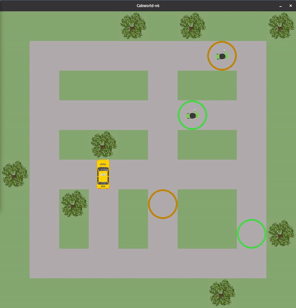
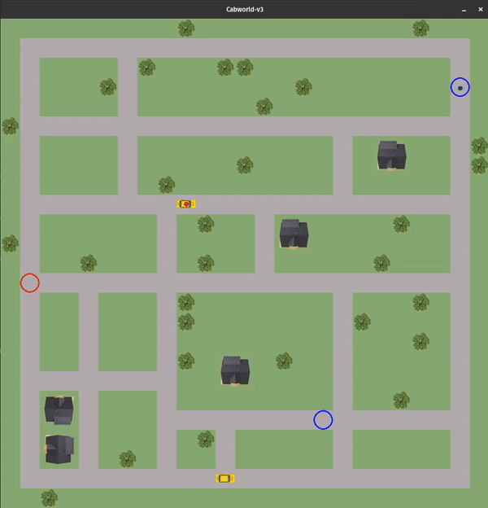

<div align="center">
		
</div>

<br/>
<div align="center">
	<a href="https://opensource.org/licenses/MIT">
		
	</a>
	<a href="https://opensource.org/licenses/MIT">
		
	</a>
	<a href="https://opensource.org/licenses/MIT">
		
	</a>
</div>

<p>
</p>

# Gym-Cabworld

Reinforcement Environment based an OpenGymAI and Pygame. 
A cab is driving around and tries to pick-up passengers in order to drive them to their destination. For each passenger the destination is marked on the map in the same color.
The environment has two different sizes (small and large) and respectively two modes (single and multi agent)

<br>
<p>
	<div align="center">
		
		
	</div>
</p>
<br>


## Installation 

```bash
pip install gym-cabworld
```

## Usage
### Single agent (Small World)
```python
import gym 
import gym_cabworld 
env = gym.make('Cabworld-v0')
env.reset()
action = env.action_space.sample()
env.step(action)
env.render()
```

### Multi agent (Big World)
```python
import gym 
import gym_cabworld 
env = gym.make('Cabworld-v3')
env.reset()
actions = [0,1]
env.step(actions)
env.render()
```

## Problem Statement

The cab(s) should learn to chauffeur as many passengers as possible to their destination in a fixed number of time steps (1000).

### 1. Environment description
1. The Map has 8x8 grids for the small world (23x23 for the big world)
2. The cab can only perform discrete actions
* 0: drive up 
* 1: drive right 
* 2: drive down 
* 3: drive left 
* 4: pick-up passenger
* 5: drop-off passenger
* 6: do nothing 
3. Rewards / Penalties
* Pick-up-reward: 100 
* Drop-off-reward: 100
* Step-penality: -1
* Do-nothing-penalty (passenger in cab): -5
* Wrong pick-up/drop-off penality: -10
* Illegal move penalty: -5


### 2. Initial conditions

Every environment starts with an initial passengers. Every 100 timesteps (50 timesteps for Mulit-Agent) a new passenger is respawn.

Note: with the help of jupyter notebooks a map of any size and with any street leading can be created.

### Cabworld-v0 (Single Agent, small map)
1. Cab starting at random position
2. Passenger with random start-position and random destination (respawn every 100 steps)

### Cabworld-v1 (Multi-Agent, small map)
1. 2 Cabs starting at the random position
2. Passenger with random start-position and random destination (respawn every 50 steps)

### Cabworld-v2 (Single Agent, big map)
1. Cab starting at random position
2. Passenger with random start-position and random destination (respawn every 100 steps)

### Cabworld-v3 (Multi-Agent, big map)
1. 2 Cabs starting at the random position
2. Passengers with random start-position and random destination (respawn 50 steps)


### 3. Expected behaviour
1. Cab(s) pick(s) up passengers as fast as possible 
2. Cab(s) bring(s) passengers to their destination as fast as possible
3. Cab(s) drop(s) off passengers at their destination
4. Cab(s) do nothing if no passenger on map

### 4. State 

The state of every environment consists of 14 values. 
* 1-4: radar-up, radar-right, radar-down, radar-left &#8712; {-1,1}
* 5: 1 if cab has passenger else 0
* 5-6: x-position, y-position of cab &#8712; [0;1]
* 7-8: x-position, y-position passenger &#8712; [0;1]

* If cab picks up a passenger, its position is replaced with its destination

Notes: 
* Radar: 1 for street, -1 for terrain
* Positions are normalized [0,1]
* If currently there is no passengers on the map, values are filled with -1

## Test 
Run 10 episodes of each version with random policy and check if states and rewards are valid.
```bash 
pytest tests.py
```

## Changelog

### [1.6.0] (https://gitlab.com/nlimbrun/cabworld/-/tags/release_1.4.0) (20.02.2021)
- Minimal state, single passenger

### [1.5.0] (https://gitlab.com/nlimbrun/cabworld/-/tags/release_1.4.0) (07.02.2021)
- New state, order passengers by spawn time

### [1.4.0] (https://gitlab.com/nlimbrun/cabworld/-/tags/release_1.4.0) (11.01.2021)
- New states, removed static environments

### [1.3.0] (https://gitlab.com/nlimbrun/cabworld/-/tags/release_1.3.0) (03.01.2021)
- Absolute actions, drive-forward only

### [1.2.0] (https://gitlab.com/nlimbrun/cabworld/-/tags/release_1.2.0) (28.12.2020)
- New state: remove pick-up, drop-off flag, extend state to 3 nearest passengers 

### [1.1.0] (https://gitlab.com/nlimbrun/cabworld/-/tags/release_1.1.0) (21.12.2020)
- New features: Do-nothing-action, Bug-Fix: remove passengers after arival

### [1.0.3] (https://gitlab.com/nlimbrun/cabworld/-/tags/release_1.0.3) (19.12.2020)
- Extended tests, fixed bug in reward system, set max-steps to 10k, respawn-rate to 100 steps

### [1.0.2] (https://gitlab.com/nlimbrun/cabworld/-/tags/release_1.0.2) (17.12.2020)
- Extended state with 3 nearest passengers, added respawn rate for passengers

### [1.0.1] (https://gitlab.com/nlimbrun/cabworld/-/tags/release_1.0.1) (12.12.2020)
- Added random seed, increase pick-up and drop-off reward to 100

### [1.0] (https://gitlab.com/nlimbrun/cabworld/-/tags/release_1.0) (09.12.2020)
- Clean-up for first release

### [0.9] (https://gitlab.com/nlimbrun/cabworld/-/tags/release_0.9) (08.12.2020)
- Integrated small world (10x10) and publish packet

### [0.8] (https://gitlab.com/nlimbrun/cabworld/-/tags/release_0.8) (30.11.2020)
- Show color of current passenger, added tests

### [0.7] (https://gitlab.com/nlimbrun/cabworld/-/tags/release_0.7) (29.11.2020)
- Extend to multi-agent, register different versions (v0, v1, v2, v3)

### [0.6] (https://gitlab.com/nlimbrun/cabworld/-/tags/release_0.6) (28.11.2020)
- Refactoring, Added State-Deck, Training-template with argparse

### [0.5] (https://gitlab.com/nlimbrun/cabworld/-/tags/release_0.5) (22.11.2020)
- Refactoring, Added Tensorboard, Include images in pip-package

### [0.4] (https://gitlab.com/nlimbrun/cabworld/-/tags/release_0.4) (22.11.2020)
- Tensorboard to compare different trainings, new features in NN, random positions

### [0.3] (https://gitlab.com/nlimbrun/cabworld/-/tags/release_0.3) (10.11.2020)
- Improved reward system, notebook to generate maps, q-learning approach

### [0.2] (https://gitlab.com/nlimbrun/cabworld/-/tags/release_0.2) (07.11.2020)
- Added actions for pick-up, drop-off and simple reward system

### [0.1] (https://gitlab.com/nlimbrun/cabworld/-/tags/release_0.1) (04.11.2020)
- Basic world with cabs and passenger (without reward system)s