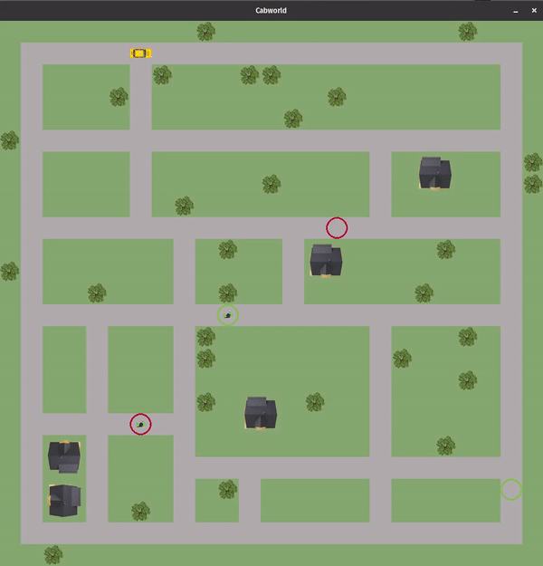

# Gym-Cabworld

Reinforcement Environment based an OpenGymAI and Pygame. 
A cab is driving around and tries to pick-up passengers to drive them to their destination.
Each passenger is marked with the same color as his destination.



## Installation 

```bash
pip install gym-cabworld
```

## Usage
### Single agent
```python
import gym 
import gym_cabworld 
env = gym.make('Cabworld-v0')
env.reset()
action = env.action_space.sample()
env.step(action)
env.render()
```

### Multi agent 
```python
import gym 
import gym_cabworld 
env = gym.make('Cabworld-v3')
env.reset()
actions = [0,1]
env.step(actions)
env.render()
```

## Problem Statement
### 1. Environment description
1. The Map has 1000 x 1000 pixels (action space is limited to 25x25 and 10x10)
2. The cab can only perform discrete actions
* 0: drive forward (1 grid (40px, 100px))
* 1: turn right (90 deg)
* 2: turn left (90 deg)
* 3: pick-up passenger
* 4: drop-off passenger
* 5: do nothing (receives step-penalty)
3. Rewards / Penalties
* Pick-up-reward: 100 
* Drop-off-reward: 100
* Step-penality: -1
* Wrong pick-up/drop-off penality: -10
* Illegal move penalty: -5

### 2. Initial conditions

To test algorithms the smaller environment (v4, v5, v6, v7) can be used.
Moreover, with the help of jupyter notebooks a map of any size and with any streets can be created.

Every dynamic environment (expect v0,v4) start with 2 initial passengers. Every 100 timesteps a new passenger is respawn up to a maximum of 5 passengers.

### Cabworld-v0 (v4 small map)
1. Cab starting at the top-left-corner
2. Passenger starting at bottom-right-corner 
3. Passenger wants to get to the top-left corner 

### Cabworld-v1 (v5 small map)
1. Cab starting at the top-left-corner
2. Passengers with random start-position and random destination

### Cabworld-v2 (v6 small map)
1. Cab starting at the random position
2. Passengers with random start-position and random destination

### Cabworld-v3 (Multi-Agent) (v7 small map)
1. 2 Cabs starting at the random position
2. Passengers with random start-position and random destination

### 3. Expected behaviour
1. Cab picks up passenger as fast as possible 
2. Cab brings passenger to their destination as fast as possible
3. Cab drops off passenger at their destination

### 4. State 

The state of every environment consists of 18 values. 
* 0: cab occupied (1) or free (-1)
* 1-3: radar-front, radar-left, radar-right 
* 4-5: x-position, y-position of cab 
* 6-9: x-position, y-position, x-destination, y-destination of passenger 1
* 10-13: "" passenger 2
* 14-17: "" passenger 3

Note: 
* Radar: 1 for street, -1 for terrain
* Positions are normalized [0,1]
* If not enough passengers on map, values are filled with -1

## Test 
Run 10 episodes of each version with random policy and check if states and rewards are valid.
```bash 
pytest tests.py
```

## Changelog

### [1.2.0] (https://gitlab.com/nlimbrun/cabworld/-/tags/release_1.2.0) (28.12.2020)
- New state: remove pick-up, drop-off flag, extend state to 3 nearest passengers 

### [1.1.0] (https://gitlab.com/nlimbrun/cabworld/-/tags/release_1.1.0) (21.12.2020)
- New features: Do-nothing-action, Bug-Fix: remove passengers after arival

### [1.0.3] (https://gitlab.com/nlimbrun/cabworld/-/tags/release_1.0.3) (19.12.2020)
- Extended tests, fixed bug in reward system, set max-steps to 10k, respawn-rate to 100 steps

### [1.0.2] (https://gitlab.com/nlimbrun/cabworld/-/tags/release_1.0.2) (17.12.2020)
- Extended state with 3 nearest passengers, added respawn rate for passengers

### [1.0.1] (https://gitlab.com/nlimbrun/cabworld/-/tags/release_1.0.1) (12.12.2020)
- Added random seed, increase pick-up and drop-off reward to 100

### [1.0] (https://gitlab.com/nlimbrun/cabworld/-/tags/release_1.0) (09.12.2020)
- Clean-up for first release

### [0.9] (https://gitlab.com/nlimbrun/cabworld/-/tags/release_0.9) (08.12.2020)
- Integrated small world (10x10) and publish packet

### [0.8] (https://gitlab.com/nlimbrun/cabworld/-/tags/release_0.8) (30.11.2020)
- Show color of current passenger, added tests

### [0.7] (https://gitlab.com/nlimbrun/cabworld/-/tags/release_0.7) (29.11.2020)
- Extend to multi-agent, register different versions (v0, v1, v2, v3)

### [0.6] (https://gitlab.com/nlimbrun/cabworld/-/tags/release_0.6) (28.11.2020)
- Refactoring, Added State-Deck, Training-template with argparse

### [0.5] (https://gitlab.com/nlimbrun/cabworld/-/tags/release_0.5) (22.11.2020)
- Refactoring, Added Tensorboard, Include images in pip-package

### [0.4] (https://gitlab.com/nlimbrun/cabworld/-/tags/release_0.4) (22.11.2020)
- Tensorboard to compare different trainings, new features in NN, random positions

### [0.3] (https://gitlab.com/nlimbrun/cabworld/-/tags/release_0.3) (10.11.2020)
- Improved reward system, notebook to generate maps, q-learning approach

### [0.2] (https://gitlab.com/nlimbrun/cabworld/-/tags/release_0.2) (07.11.2020)
- Added actions for pick-up, drop-off and simple reward system

### [0.1] (https://gitlab.com/nlimbrun/cabworld/-/tags/release_0.1) (04.11.2020)
- Basic world with cabs and passenger (without reward system)s