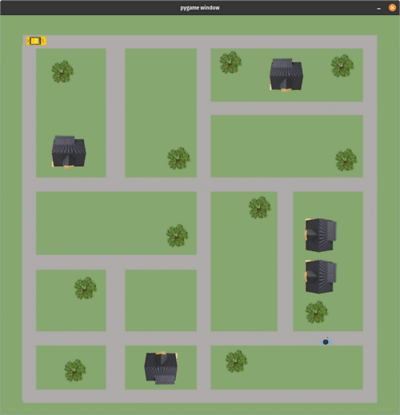

# Gym-Cabworld

Reinforcement Environment based an OpenGymAI and Pygame



# Installation 

```bash
git clone https://gitlab.com/nlimbrun/cabworld.git
cd gym-cabworld
pip install -r requirements.txt
pip install -e .
```

# Import 

```python
import gym 
import gym_cabworld 
env = gym.make('Cabworld-v0')
action = env.action_space.sample()
env.step(action)
env.render()
```