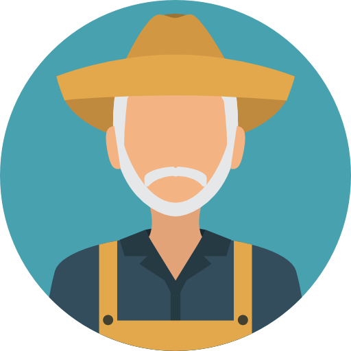

<div align="center">
		
</div>

<br/>
<div align="center">
	<a href="https://opensource.org/licenses/MIT">
		
	</a>
	<a href="https://opensource.org/licenses/MIT">
		
	</a>
</div>

<p>
</p>

# Gym-Farmworld

Reinforcement Environment based an OpenGymAI and Pygame. 
A tractor is driving around and tries to pick-up hay in order to bring it to the barn.
The environment has two different sizes (small and large) and respectively two modes (single and multi agent)

<br>
<p>
	<div align="center">
		
	</div>
</p>
<br>

## Installation 

```bash
pip install gym-farmworld
```

## Usage
### Single agent (Small World)

```python
import gym 
import gym_farmworld 
env = gym.make('Farmworld-v0')
env.reset()
action = env.action_space.sample()
env.step(action)
env.render()
```

## Problem Statement

The tractor(s) should learn to bring the hay to the barn as fast as possible.

### 1. Environment description
1. The Map has 8x8 grids for the small world (23x23 for the big world)
2. The tractor can only perform discrete actions
* 0: drive up 
* 1: drive right 
* 2: drive down 
* 3: drive left 
* 4: pick-up hay
* 5: drop-off hay
* 6: do nothing 
3. Rewards / Penalties
* Pick-up-reward: 100 
* Drop-off-reward: 100
* Step-penality: -1
* Do-nothing-penalty (loaded with hay): -5
* Wrong pick-up/drop-off penality: -10
* Illegal move penalty: -5

### 2. Initial conditions

Every environment starts with an some initial hay. The episode ends when all the hay is in the barn.
Note: with the help of jupyter notebooks a map of any size can be created.

### Farmworld-v0 (Single Agent, small map)
1. Tractor starting at random position
2. 10 Hay with random start-position and fixed destination (barn)

### 3. Expected behaviour
1. Tractor(s) pick(s) up hay as fast as possible 
2. Tractor(s) bring(s) hay to their destination (barn) as fast as possible
3. Tractor(s) drop(s) off hay at the barn

### 4. State 

The state of every environment consists of 9 values. 
* 1-4: radar-up, radar-right, radar-down, radar-left &#8712; {-1,1}
* 5: 1 if tractor has hay on board else 0
* 5-6: x-position, y-position of tractor &#8712; [0;1]
* 7-8: x-position, y-position hay &#8712; [0;1]

* If tractor picks up hay, its position is replaced with its destination

Notes: 
* Radar: 1 for field, -1 for other terrain
* Positions are normalized [0,1]
* If currently there is no hay on the map, values are filled with -1

## Test 
Run 10 episodes of each version with random policy and check if states and rewards are valid.
```bash 
pytest tests.py
```

## Changelog

### [0.1] (07.03.2021)
- Forked cabworld
